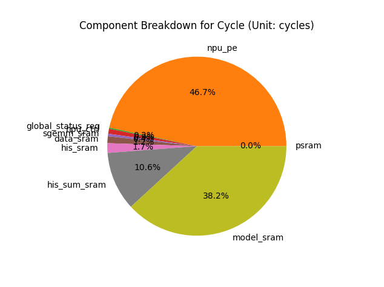

# Shensilicon Microchip Architectural Reference Tool

### Version 1.0

*Updated 2021-06-04 by Jay Yu*

*Shensilicon Semiconductors*

## Overview

The **Shensilicon Microchip Architectural Reference Tool (SMART)** is a project designed to provide assistance in the design of the Shensilicon TH-series microchips through quantitative analysis of architectures' **energy (pJ)**, **area (um^2)** and **cycle** consumption when running Neural Networks. The SMART Project is split into three main parts:

1. The **Estimator** acts as an engine and core analysis tool for the project. It takes in an `architecture.yaml` and an `operations.yaml` and will output a detailed analysis of energy/area/cycle consumption
2. The **Smapper**  is the default SMART Mapper that will take in an Architecture and a Neural Network shape. The Smapper will search for firmware possibilities to 'map' the Neural Network onto the given Architecture (if possible), creating relevant operations and use the Estimator to evaluate the efficacy of this architecture + operation combination. The Smapper will return the top firmware solutions given a certain firmware scoring function.
3. The **Searcher** is a hardware architecture searcher. Given a `meta-architecture.yaml` and a `neural_network.yaml`, the searcher will iterate over a possibility space that represents all the different Architectures that are legal given the constraints of the `meta-architecture.yaml`, and use the Smapper to evaluate the optimal firmware mapping for each separate Architecture. It will then rank the hardware architectures based on their score, and ultimately output a detailed analysis of the best ranked hardware architectures through the Estimator.

## Quick Start

### Dependencies

Packages are used outside of the default Python packages. These need to be installed via:

```bash
pip install -r requirements.txt
```

### Run Searcher

In the main `SMART_Project` directory, execute `main.py` with no runtime arguments to run the Searcher module, which is a hardware searcher.

The Searcher module takes two inputs, defined in `main.py` code (`run_searcher()` method):

- Neural Network Shape: `project_io/searcher_input/neural_network.yaml`. Currently supports DNN and CNN model shapes.
- Meta-Architecture Model: `project_io/searcher_input/original_arch/meta_architecture.yaml`. The meta compound components used in this architecture are defined in the `meta_components` folder in the same directory

Searcher will output the results of the search in the folder of `project_io/test_run/run_{run_id}` where `run_id` is given by `time.time_ns()`

### Run Smapper

To run the Smapper from an `architecture` file and `neural_network` file, change the `__main__` method in`main.py` to `run_smapper()`, and enter the architecture/neural network file paths

The Smapper module takes two inputs, defined in `main.py` code (`run_smapper()` method):
- Neural Network Shape: `project_io/mapper_input/neural_network.yaml`. Currently only supports DNN and CNN model shapes.
- Architecture Model: `project_io/mapper_input/architecture.yaml`. The compound components used in this architecture are defined in the `components` folder in the same directory

Smapper will output onto terminal results of firmware combinations estimated, and a ranking of the firmware.

### Run Estimator

To run only the Estimator from an `architecture` file and `operations` file, change the `__main__` method in`main.py` to run estimator, and enter the architecture/operations file paths

Defaults:

- Architecture Model: `project_io/estimator_input/architecture.yaml` The compound components used in this architecture are defined in the `components` folder in the same directory
- Operations List: `project_io/estimator_output/operations.yaml`

## Project Timeline

The SMART project is split into three parts, as follows:

|      | Name               | Target   | Goals                                                        | Timeline          |
| ---- | ------------------ | -------- | ------------------------------------------------------------ | ----------------- |
| 1    | Architecture Phase | Hardware | Define and model hardware architectural components and corresponding operations. Output Feature Estimation documents | Feb 20 - March 20 |
| 2    | Mapping Phase      | Firmware | Define and model NN shapes. Create "mappings" representing firmware that places DNN shape onto the hardware architecture | March 20 - May 1  |
| 3    | Searching Phase    | Software | Given a set of NN parameters and constraints, automatically generate optimized mappings using a searching algorithm. | May 1 - June 15   |

## Functionality

### Part 1:  Architecture Phase

As of 2021-04-06, SMART has completed the requirements for Part 1. It is able to:

- [x] Read and store "Primitive Components" (PC) -- which are basic hardware units such as registers, MAC units, SRAM --  in a SQLite database, the *Intelligent Primitive Component Library* (IPCL)

- [x] Within the IPCL, each database represents a different hardware configuration, and each PC has an accompanying set of "feature scripts" to calculate the features of **energy, area, cycle**.

- [x] Allow the user to instantiate "Compound Components," (CC) which are different combinations of PCs and other CCs, allowing for the description of components that have more than one individual component inside (eg. a Processing Element may contain both a MAC unit and a register)

- [x] Allow the user to define an Architecture YAML template using both PC and CC

- [x] Allow the user to define an Operations YAML template detailing the operations to be conducted, which easily describe serial/parallel/pipeline actions 

- [x] Output Feature Reference Tables for the features of **energy, area, cycle**, given an Architecture template, detailing statistics for each component's operation.

- [x] Output Feature Estimation for the features of **energy, area, cycle**, given an Architecture and Operations template

- [x] Output Component Breakdowns for each Feature Estimation as a Pie Chart

- [x] Output the Component-Operation Matrix for each Feature Estimation as a .csv file

### Part 2: Mapping Phase

As of 2021-05-20, SMART has completed the following requirements for Part 2. It is able to:

- [x] Define the Neural Network YAML structure, so that it is able to describe the key features of a DNN/CNN
- [x] Given a Neural Network (DNN/CNN) shape, generate different tiling solutions based on factorization properties
- [x] Given a tiling combination, determine whether it can fit on a hardware Architecture. If so, generate the corresponding `operations.yaml` file, and connect this to the Estimator API
- [x] Define a scoring algorithm for firmware that takes in energy, area, cycle data, and outputs a weighted score. Rank the different firmware tiles according to the score they receive.
- [x] Use multiple firmware searching algorithms, including linear search and Bayesian Optimization method to conduct the firmware search, and allow the user to specify which algorithm to conduct firmware search

### Part 3: Searching Phase

As of 2021-06-04, SMART has completed the following requirements for Part 3. It is able to:

- [x] Define Meta-Architecture YAML template, which is based on the Architecture YAML template but allows the user to use a list to define the different hardware parameters they wish to be searched along
- [x] Define Meta-Compound-Component YAML, which is based on the Compound Component YAML, but allows the user to use a list to define the different hardware parameters they wish to be searched along
- [x] Allow the user to define multiple instances of the same component inside the Meta-Compound-Component, and vary the amount of instances like a search parameter
- [x] Create a searching algorithm that can iterate over the different hardware architectures possible as constrained by the Meta-Architecture YAML, and connect this to the Smapper API
- [x] Add in a logger module to record the different hardware-firmware combinations searched, as well as keep track of how many combinations have been searched
- [x] Rank the different hardware architectures according to their best-performing firmware results.
- [x] For the top N architecture solutions (with N defined by the user), output the detailed analysis as a folder, consisting of pie charts, TXT analysis, and the relevant component-operation matrix.

### Sample Output: VAD Cycle Estimation

```
░██████╗███╗░░░███╗░█████╗░██████╗░████████╗
██╔════╝████╗░████║██╔══██╗██╔══██╗╚══██╔══╝
╚█████╗░██╔████╔██║███████║██████╔╝░░░██║░░░
░╚═══██╗██║╚██╔╝██║██╔══██║██╔══██╗░░░██║░░░
██████╔╝██║░╚═╝░██║██║░░██║██║░░██║░░░██║░░░
╚═════╝░╚═╝░░░░░╚═╝╚═╝░░╚═╝╚═╝░░╚═╝░░░╚═╝░░░
Shensilicon Microchip Architectural Reference Tool
==================================================
===== Cycle Estimation ======
	Component: psram
	Value: 0 cycles

	Component: npu_pe
	Value: 6752 cycles

	Component: global_status_reg
	Value: 30 cycles

	Component: npu_ctrl
	Value: 128 cycles

	Component: sgemm_sram
	Value: 65 cycles

	Component: data_sram
	Value: 179 cycles

	Component: his_sram
	Value: 252 cycles

	Component: his_sum_sram
	Value: 1536 cycles

	Component: model_sram
	Value: 5520 cycles

====================
Total Cycle Estimation: 7380 cycles
```
### Sample Output: Pie Chart for VAD Cycle Estimation


