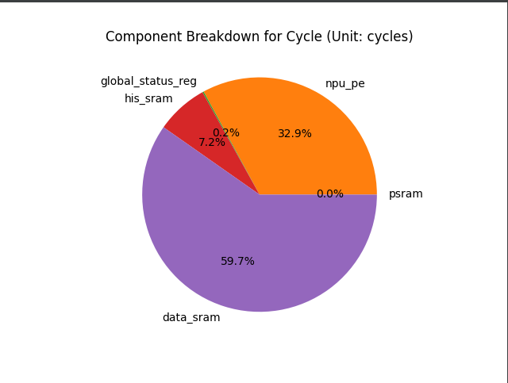

# SMART Estimator

*Updated 2021-06-04 by Jay Yu*

*Shensilicon Semiconductors*

## Overview

The **Shensilicon Microchip Architectural Reference Tool (SMART)** is a project designed to provide assistance in the design of the Shensilicon TH-series microchips through quantitative analysis of architectures' **energy (pJ)**, **area (um^2)** and **cycle** consumption when running Neural Networks. The **SMART Estimator** acts as an engine and core analysis tool for the project.

Inputs:

- Architecture YAML file: describing the hardware architecture to be analyzed
- Operations YAML file: describing the operations the hardware architecture carries out
- IPCL SQLite Database: Contains the energy/area/cycle functions for basic hardware components (eg. SRAM, intmac, register)
- (Optional) Compound Components Folder: Describes more complex, user-defined microarchitectures that may be specific to a certain architecture (eg. processing element)

Outputs:

- Energy/Area/Cycle Component Breakdown TXT analysis
- Energy/Area/Cycle Matrix, detailing the breakdown at each operation for each component
- Energy/Area/Cycle Pie Chart, graphically analyzing the breakdown for each component

## Quick Start

To run *only* the SMART Estimator on a specific architecture/operation

1. Make sure the packages in `dependencies.txt` are downloaded successfully
2. Change the function inside `main.py` to `run_estimator` and edit the file paths for the inputs and outputs


### Functionality

As of **SMART v1.0**, the SMART Estimator has the following capabilities

- [x] Read and store "Primitive Components" (PC) -- which are basic hardware units such as registers, MAC units, SRAM --  in a SQLite database, the *Intelligent Primitive Component Library* (IPCL)

- [x] Within the IPCL, each database represents a different hardware configuration, and each PC has an accompanying set of "feature scripts" to calculate the features of **energy, area, cycle**.

- [x] Allow the user to instantiate "Compound Components," (CC) which are different combinations of PCs and other CCs, allowing for the description of components that have more than one individual component inside (eg. a Processing Element may contain both a MAC unit and a register)

- [x] Allow the user to define an Architecture YAML template using both PC and CC

- [x] Allow the user to define an Operations YAML template detailing the operations to be conducted, which can easily describe **serial**, **parallel**, and **pipeline** operations.

- [x] Output Feature Reference Tables for the features of **energy, area, cycle**, given an Architecture template, detailing statistics for each component's operation.

- [x] Output Feature Estimation for the features of **energy, area, cycle**, given an Architecture and Operations template

- [x] Output Component Breakdowns for each Feature Estimation as a Pie Chart

- [x] Output the Component-Operation Matrix for each Feature Estimation as a .csv file


### Sample Output: VAD Cycle Estimation

```
░██████╗███╗░░░███╗░█████╗░██████╗░████████╗
██╔════╝████╗░████║██╔══██╗██╔══██╗╚══██╔══╝
╚█████╗░██╔████╔██║███████║██████╔╝░░░██║░░░
░╚═══██╗██║╚██╔╝██║██╔══██║██╔══██╗░░░██║░░░
██████╔╝██║░╚═╝░██║██║░░██║██║░░██║░░░██║░░░
╚═════╝░╚═╝░░░░░╚═╝╚═╝░░╚═╝╚═╝░░╚═╝░░░╚═╝░░░
Shensilicon Microchip Architectural Reference Tool
==================================================
===== Cycle Estimation ======
	Component: psram
	Value: 0 cycles

	Component: npu_pe
	Value: 5520 cycles

	Component: global_status_reg
	Value: 29 cycles

	Component: his_sram
	Value: 1202 cycles

	Component: data_sram
	Value: 10018 cycles

====================
Total Cycle Estimation: 10077 cycles

```

### Sample Output: Pie Chart for VAD Cycle Estimation



